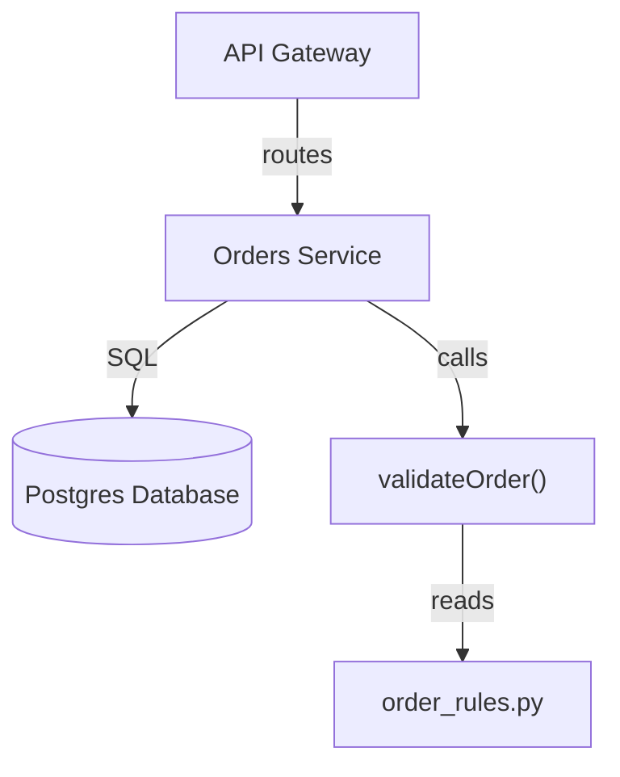
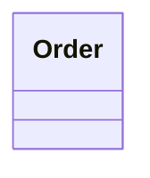

# Two diagrams in one file

```mermaid
flowchart TB
    gw["API Gateway"] -->|"routes"| orders["Orders Service"]
    orders -->|"SQL"| pg[("Postgres Database")]
    orders -->|"calls"| h["validateOrder()"]
    h -->|"reads"| f["order_rules.py"]
```

```mermaid
classDiagram
    class Order
```
